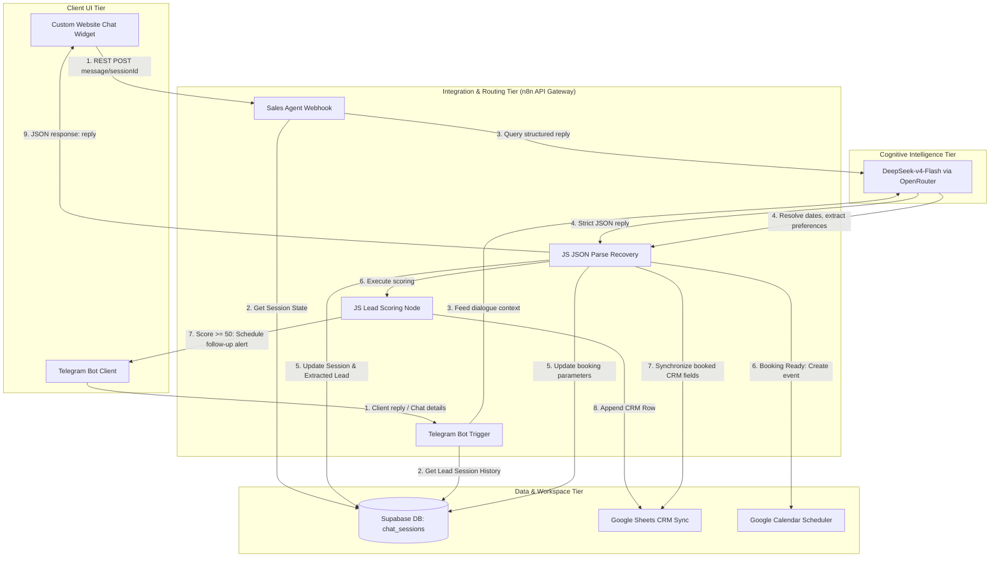

# Aria AI – Autonomous Real Estate Sales Agent

<div align="center">

[](LICENSE)
[](https://n8n.io/)
[](https://supabase.com/)
[](https://openrouter.ai/)
[](CONTRIBUTING.md)

**An production-grade, 24/7 autonomous AI Property Consultant system that automates the complete real estate lead lifecycle — from website engagement to qualification, prioritization, automated calendar booking, and CRM synchronization.**

---

[Key Features](#key-features) • [System Architecture](#system-architecture) • [Directory Structure](#directory-structure) • [Deep Technical Highlights](#deep-technical-highlights) • [Quick Start](#quick-start) • [Documentation Index](#technical-documentation-suite)

</div>

---

## The Problem

In high-ticket real estate sales, **latency kills deals**. When a prospective buyer submits an inquiry, their intent is at its peak.
- **The Gap**: Human agents are rarely available 24/7 to answer immediate pricing, configuration, or scheduling inquiries.
- **The Cost**: Delayed follow-ups lead to lost prospects, high advertising burn rates, and overwhelmed sales teams wading through unqualified, low-intent leads.
- **The Solution**: **Aria AI** acts as an instant, conversational tier-1 sales consultant. It qualifies visitors conversational, calculates real-time lead priorities, sends hot-lead alerts to agents on Telegram, and secures site visits directly in Google Calendar.

---

## Key Features

- **Floating Website Chat Widget**: Modern glassmorphic web client with persistent sessions, floating trigger bubbles, and conversational autocomplete options.
- **Stateful Lead Qualification**: Core intake agent that conversational collects Name, Phone, Email, Location, Budget, and Urgency Timeline, returning structured JSON schemas.
- **Mathematical Lead Prioritization**: Dynamic scoring engine assigning points for contact channels, budgets, and urgency, segmenting leads into HOT, WARM, and COLD profiles.
- **Outbound Automated Follow-up**: Generates warm, personalized WhatsApp-style follow-up copy (max 55 words) and sends alerts to agents on Telegram.
- **Conversational Booking Agent**: High-end scheduler bot running on Telegram, resolving relative dates ("tomorrow", "this Saturday") and logging physical site-visits.
- **Dual CRM Synchronization**: Appends qualified leads and schedules viewings to Google Sheets CRM and Google Calendar.

---

## System Architecture

Aria's decoupled, event-driven topology is orchestrated around an API gateway, state repository, and cognitive brain:



For a detailed walkthrough of technical sequence diagrams and design topologies, explore our [Architecture Document](docs/Architecture.md).

---

## Directory Structure

Aria AI is structured cleanly to support rapid configuration, local development, and seamless deployment:

```
aria-ai-real-estate-agent/
├── README.md               # Master Landing Page and Project Overview
├── LICENSE                 # Permissive MIT License
├── .gitignore              # Ignored environment, Node, and IDE configurations
├── .env.example            # Environment variables configuration template
├── CHANGELOG.md            # release milestones following Keep a Changelog
├── CONTRIBUTING.md         # Open-source developer setup instructions
├── CODE_OF_CONDUCT.md      # Contributor Covenant guidelines
├── database/
│   ├── schema.sql          # Complete Supabase DDL for chat_sessions table & indexes
│   └── seed.sql            # Seed SQL scripts representing hot/warm/cold mock profiles
├── workflow/
│   ├── sales-agent-workflow.json   # Cleaned n8n primary qualification workflow
│   └── booking-agent-workflow.json # Cleaned n8n conversational scheduling workflow
├── widget/                 # Premium chat widget frontend
│   ├── index.html          # Custom luxury portal demo page (Bluestone Estates)
│   ├── widget.html         # Embedded chat widget container
│   ├── style.css           # Glassmorphism visual styling sheet
│   ├── script.js           # Client-side lifecycle state and fetch client
│   ├── config.js           # Webhook address and brand configurations
│   └── embed.js            # Sandboxed iframe embed script wrapper
├── prompts/                # Raw AI system instructions and JSON schemas
│   ├── qualification_agent.txt
│   ├── followup_generator.txt
│   └── booking_agent.txt
├── images/                 # System diagrams, assets, and flow screenshots
│   └── workflow_screenshot.jpg # Production visual n8n execution trail screenshot
└── docs/                   # Production-quality technical documentation suite
    ├── Architecture.md     # Decoupled event-driven architecture design
    ├── Workflow.md         # Detailed node-by-node analysis and config guides
    ├── Installation.md     # Step-by-step setup guides for local / VPS runtimes
    ├── Database.md         # Data dictionary, GIN indexes, and design rationales
    ├── LeadScoring.md      # Math formula, scoring matrices, and JS node code
    ├── Deployment.md       # Secure webhooks, SSL, rate-limiting, and HA scaling
    ├── PromptEngineering.md# OpenRouter setups, JSON recovery, and prompt rules
    └── Widget.md           # design systems, design customizer, and embeds
```

---

## Deep Technical Highlights

### 1. Mathematical Lead Scoring Engine
Leads are evaluated conversational and classified dynamically based on their weighted properties. The Raw Score is computed as:

$$\text{Raw Score} = S_{\text{phone}} (10) + S_{\text{email}} (5) + S_{\text{location}} (10) + S_{\text{budget}} (25) + S_{\text{timeline}} (35)$$
$$\text{Final Score} = \min(100, \text{Raw Score})$$

Leads scoring $\ge 80$ are segmented as **HOT** (triggering instant sales alerts and immediate outreach); those $\ge 50$ are **WARM** (queued for automated follow-ups), and the rest are **COLD** (saved quietly to nursery lists).
Explore the full mathematical model and javascript logic in [LeadScoring.md](docs/LeadScoring.md).

### 2. Zero-Join Database Design
To eliminate connection bottlenecks, Aria uses a unified flat table design (`chat_sessions`) inside Supabase. This consolidates session state, raw transcripts, and extracted lead fields into a single row, providing **zero-join, sub-millisecond query performance** during high-concurrency chat sessions.
Explore our data dictionary and GIN index optimizations in [Database.md](docs/Database.md).

### 3. Prompt Resiliency & Parsing Recovery
Extracting strict JSON schemas from conversational AI is notoriously brittle. Aria implements an advanced **Parse Recovery Layer** inside n8n via a JavaScript Code Node. If the LLM returns trailing conversational text or ignores the raw instructions by wrapping output in markdown markers, the recovery script cleans and extracts the valid JSON object safely.
Explore our prompts, few-shots, and parse-repair script in [PromptEngineering.md](docs/PromptEngineering.md).

---

## Quick Start

Get your local self-hosted Aria AI instance up and running in **under 10 minutes**:

### 1. Initialise the Database
Sign up to [Supabase](https://supabase.com/), create a database project, paste the contents of [database/schema.sql](database/schema.sql) into the **SQL Editor**, and click **Run**.

### 2. Launch n8n via Docker Compose
Create a `docker-compose.yml` file:
```yaml
version: '3.8'
services:
  n8n:
    image: docker.n8n.io/n8nio/n8n:latest
    ports:
      - "5678:5678"
    environment:
      - N8N_HOST=localhost
      - WEBHOOK_URL=https://your-tunnel.ngrok-free.dev
    volumes:
      - n8n_storage:/home/node/.n8n
volumes:
  n8n_storage:
```
Launch n8n:
```bash
docker-compose up -d
```

### 3. Import and Activate Workflows
1. Access your n8n dashboard at `http://localhost:5678`.
2. Go to **Workflows** -> **Import from File**, select [sales-agent-workflow.json](workflow/sales-agent-workflow.json) and save.
3. Configure your Supabase, OpenRouter API keys, Google Sheets, and Telegram Bot tokens inside the credential windows.
4. Set the workflow to **Active**.
5. Repeat for [booking-agent-workflow.json](workflow/booking-agent-workflow.json).

### 4. Test the Website Widget Locally
Edit [widget/config.js](widget/config.js) to specify your active n8n webhook URL. Then, run a local web server:
```bash
python -m http.server 3000 --directory ./widget
```
Open `http://localhost:3000` in your web browser. The luxury demo site of **Bluestone Estates** will render, and you can begin qualifying your first simulated lead conversational!

Explore our full [Installation Guide](docs/Installation.md) for extensive configurations.

---

## Technical Documentation Suite

Dive deeper into individual component specs:

1. 📂 **[Architecture & Flow Topology](docs/Architecture.md)**: Master topology, data flows, and system sequencers.
2. 📂 **[Workflow Engine Configuration](docs/Workflow.md)**: Node-by-node analysis, setup guides for Sheets, Calendar, and Webhooks.
3. 📂 **[Installation & Self-Hosting](docs/Installation.md)**: Step-by-step guides for Docker, Supabase, APIs, and local widgets.
4. 📂 **[Database Schema & Dictionary](docs/Database.md)**: Data dictionary, GIN indexes, and flat table rationales.
5. 📂 **[Lead Scoring & Priorities](docs/LeadScoring.md)**: Point weighting matrices, classification logic, and scoring Javascript.
6. 📂 **[Deployment & Hardening Checklist](docs/Deployment.md)**: CORS, reverse-proxies, rate limits, SSL, and scalability guide.
7. 📂 **[Prompt Engineering & JSON Schemas](docs/PromptEngineering.md)**: DeepSeek configs, raw prompts, schemas, and parse recovery logic.
8. 📂 **[Widget Customization & Embeds](docs/Widget.md)**: Glassmorphic tokens, event loops, persistent sessioning, and embedding options.

---

## Contributing & License

We love open-source collaboration! Please read our [Contributing Guidelines](CONTRIBUTING.md) and [Code of Conduct](CODE_OF_CONDUCT.md) before opening a Pull Request.

This project is licensed under the permissive **MIT License** — explore [LICENSE](LICENSE) for details.
