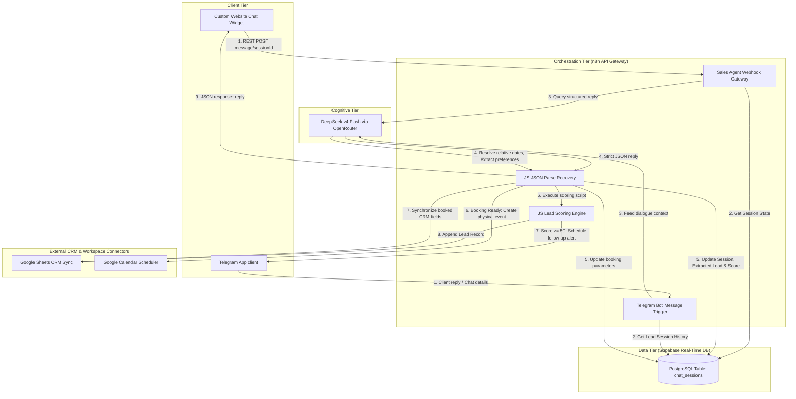
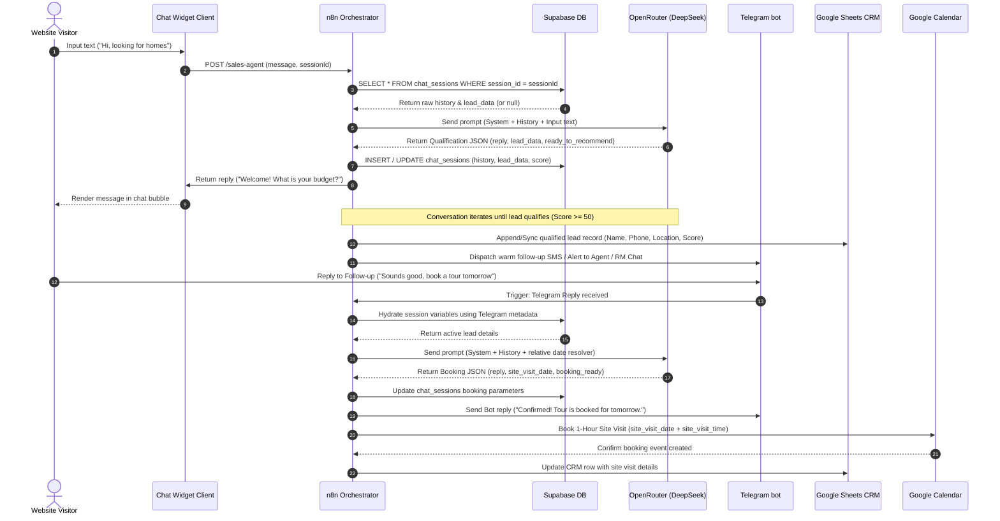

# System Architecture & Design Topology

Aria AI is structured around a decoupled, highly responsive event-driven topology. By separating the client UI, database state, orchestration engine, and cognitive model tier, the system achieves sub-second UI interactions while managing complex business integrations.

---

## Technical Architecture Overview

Aria AI uses **n8n** as a lightweight, low-code integration router, **Supabase (PostgreSQL)** as a real-time state repository, and **OpenRouter (DeepSeek-v4-Flash)** as a high-speed qualification brain.

---

## Event-Driven Sequence Diagram

The interaction sequence during the double-phase lead qualification and scheduling cycle is detailed below:

---

## Technical Decisions & Rationales

### 1. n8n as the Core Orchestrator
Many contemporary AI projects use heavy frameworks like LangChain (Python) or LlamaIndex in backend services. Aria intentionally uses **n8n** for orchestration.
- **Visual Debugging**: n8n provides a visual node-by-node execution trail. Real estate agency owners or operations managers can inspect failed runs, monitor active leads, and verify integrations without command-line code.
- **Native Oauth Connectors**: Managing OAuth authentication for Google Sheets and Google Calendar in custom Python code is complex. n8n abstracts this completely with secure, native credentials management.

### 2. DeepSeek-v4-Flash via OpenRouter
- **Parsing Strictness**: Enforces JSON schema extraction with extremely high compliance, bypassing the need for heavier LLM models.
- **Latency**: Under 1.5s rountrip, crucial for keeping website visitors engaged in conversation.

### 3. Supabase Memory Layer
- Using Supabase's fully-managed PostgreSQL gives us a production-grade database out of the box with zero local hosting friction. This allows seamless transitions from development to production without changing the database layer.
