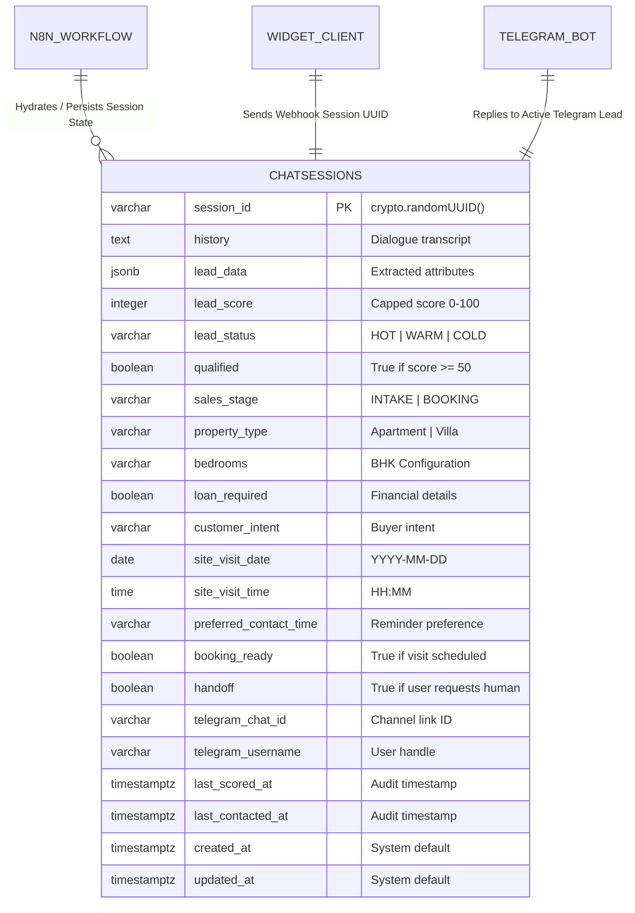

# Database Architecture & Schema design

Aria AI uses **Supabase (PostgreSQL)** as its low-latency, real-time persistence layer. The core storage schema is built around a unified, transaction-optimized table structure designed to support high-throughput, session-centric conversational agents.

---

## Entity Relationship Diagram (ERD)

Although Aria utilizes a highly flattened, high-speed single table schema (`chat_sessions`) in production to streamline n8n queries, its architectural position and logical relationship within the system are mapped out below:



---

## Data Dictionary: `chat_sessions`

Below is the complete database specification for the production schema:

| Column Name | PostgreSQL Type | Constraints / Default | Description |
| :--- | :--- | :--- | :--- |
| `session_id` | `VARCHAR(255)` | `PRIMARY KEY` | Unique identifier generated client-side (`crypto.randomUUID()`) to isolate conversation contexts. |
| `history` | `TEXT` | `DEFAULT ''` | Raw, consolidated chronological transcript of human-agent dialogue. Used directly for model context windows. |
| `lead_data` | `JSONB` | `DEFAULT '{}'::jsonb` | Semi-structured JSON object containing extracted attributes: `name`, `phone`, `email`, `preferred_location`, `budget`, and `purchase_timeline`. |
| `lead_score` | `INTEGER` | `DEFAULT 0` | Mathematical priority score computed by the javascript runtime. |
| `lead_status` | `VARCHAR(50)` | `DEFAULT 'COLD'` | Lead prioritization segment: `HOT`, `WARM`, or `COLD`. |
| `qualified` | `BOOLEAN` | `DEFAULT FALSE` | High-level status indicating the lead score has cleared the action threshold ($\ge 50$). |
| `sales_stage` | `VARCHAR(50)` | `DEFAULT 'INTAKE'` | Tracks lead context: `INTAKE` (qualification chat), `BOOKING` (scheduling chat), or `COMPLETED`. |
| `property_type` | `VARCHAR(100)` | `NULL` | Extracted property category during scheduling phase (e.g., "Villa", "Apartment"). |
| `bedrooms` | `VARCHAR(50)` | `NULL` | Configuration size preference (e.g., "3 BHK"). |
| `loan_required` | `BOOLEAN` | `DEFAULT FALSE` | Financial intent flag indicating the lead needs mortgage guidance. |
| `customer_intent`| `VARCHAR(255)` | `NULL` | AI-extracted classification of user interaction intent. |
| `site_visit_date`| `DATE` | `NULL` | Standardized date (YYYY-MM-DD) for physical site visits. |
| `site_visit_time`| `TIME` | `NULL` | Standardized time (HH:mm) for site visits. |
| `preferred_contact_time` | `VARCHAR(100)`| `NULL` | Best time for relationship managers to contact the buyer. |
| `booking_ready` | `BOOLEAN` | `DEFAULT FALSE` | Flagged `TRUE` when both calendar date and time are secured. Triggers automated GCalendar booking. |
| `handoff` | `BOOLEAN` | `DEFAULT FALSE` | Flagged `TRUE` if the customer explicitly requests human agent support. |
| `telegram_chat_id`| `VARCHAR(100)` | `NULL` | Identifies the lead's Telegram connection channel, used to route replies. |
| `telegram_username`| `VARCHAR(100)`| `NULL` | The user's Telegram username. |
| `last_scored_at` | `TIMESTAMPTZ` | `NULL` | Timestamp of last scoring run. |
| `last_contacted_at`| `TIMESTAMPTZ`| `NULL` | Timestamp of last outgoing follow-up. |
| `created_at` | `TIMESTAMPTZ` | `DEFAULT now()` | Record insertion audit timestamp. |
| `updated_at` | `TIMESTAMPTZ` | `DEFAULT now()` | Automatically updated on record modifications via trigger. |

---

## Architectural Rationale: Why a Unified Flat Table?

Traditional database architecture encourages high normalization (splitting data into `leads`, `sessions`, `messages`, and `bookings` tables with relational foreign keys). Aria intentionally takes an alternative approach, consolidating session-state and lead-data into a single, comprehensive `chat_sessions` table.

### 1. Zero-Join Low-Latency Performance
In automated conversational AI systems, response latency directly impacts conversion. By storing all active state (history, user details, scheduling details) in a single record, n8n can retrieve the complete conversation context in a single query `SELECT * FROM chat_sessions WHERE session_id = :id`. This completely eliminates `JOIN` latency under high-concurrent loads.

### 2. Simplified n8n State Management
n8n workflows are stateless between executions. For each chat bubble the user sends, the workflow must wake up, read previous history, process the new input, update history, and sleep.
A flat single-record structure allows n8n to retrieve and write back the entire session payload seamlessly in standard key-value blocks, drastically simplifying n8n node configuration and avoiding complex, error-prone nested SQL queries.

### 3. GIN Indexing for Schema Flexibility
By storing lead attributes in a `JSONB` column (`lead_data`), we gain schema flexibility. If marketing decides tomorrow to collect a new qualification field (e.g., "current_city" or "is_investor"), we can update our AI qualification prompts without altering our database tables or applying migration scripts. The PostgreSQL **Generalized Inverted Index (GIN)** on `lead_data` ensures we can still perform extremely fast queries inside the JSON payloads:

```sql
CREATE INDEX idx_chat_sessions_lead_data_gin ON chat_sessions USING gin (lead_data);
```
This index allows instantaneous queries on nested attributes, such as:
```sql
SELECT * FROM chat_sessions WHERE lead_data @> '{"preferred_location": "Whitefield"}';
```
