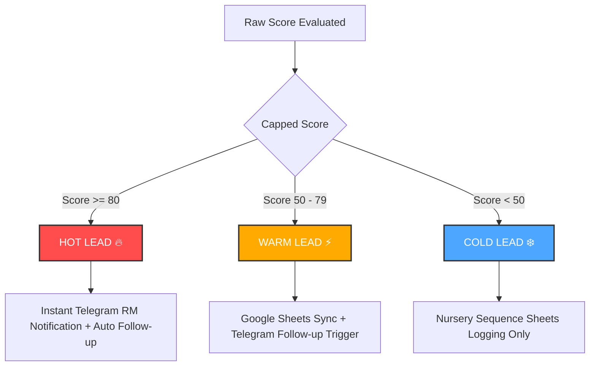

# Lead Scoring & Classification Engine

Aria AI features a deterministic, mathematically rigorous client-side lead scoring engine that evaluates completed lead profiles and segments them into priority levels. This ensures that relationships managers can focus their energy on high-value, high-intent prospects immediately.

---

## The Scoring Algorithm

The lead scoring algorithm is implemented as an n8n JavaScript Code Node. It evaluates five distinct categories of user-provided information, weighting them based on their correlation with purchase conversion rates.

The raw score is computed as:

$$\text{Raw Score} = S_{\text{phone}} + S_{\text{email}} + S_{\text{location}} + S_{\text{budget}} + S_{\text{timeline}}$$

$$\text{Final Score} = \min(100, \text{Raw Score})$$

### Score Breakdown by Category

| Category | Criterion | Points | Rationale |
| :--- | :--- | :---: | :--- |
| **Identity & Contact** | Phone Number Provided | `+10` | Indispensable for outbound sales outreach. |
| | Email Address Provided | `+5` | Useful for newsletters and brochure delivery. |
| **Location Fit** | Location matches target focus (e.g., Whitefield, Sarjapur) | `+10` | Perfect alignment with Bluestone flagships. |
| | Other locations | `+10` | Broad interest still valuable. |
| **Financial Qualification**| Budget $\ge$ ₹1 Crore | `+25` | High-value luxury segment prospect. |
| | Budget $\ge$ ₹75 Lakhs | `+20` | Core mid-to-luxury segment buyer. |
| | Budget < ₹75 Lakhs | `+10` | Value segment explorer. |
| **Urgency / Timeline** | "Immediately" | `+35` | Urgent buyer, likely ready for direct sales handoff. |
| | "Within 3 Months" | `+25` | Active buyer, in advanced search stage. |
| | "Within 6 Months" | `+15` | Mid-term interest, nurture required. |
| | "Just Exploring" | `+5` | Passive browser, low-urgency category. |

---

## Lead Classification & Segments

Leads are categorized into three strategic priority levels based on their final capped score:



### 1. HOT Leads ($\ge 80$)
- **Action**: Instant push notification via Telegram Bot directly to the Sales Team chat + automated immediate WhatsApp follow-up generation.
- **Strategic Value**: Immediate sales priority; target contact time is under 15 minutes.

### 2. WARM Leads ($50 - 79$)
- **Action**: Synchronized to Google Sheets CRM, appended with automated follow-up scheduling.
- **Strategic Value**: Active interest, requires nurturing and automated site visit scheduling.

### 3. COLD Leads ($< 50$)
- **Action**: Quietly synchronized to Google Sheets CRM for nursery marketing lists. No instant Telegram alarms or direct follow-up triggered.
- **Strategic Value**: Passive browsers or low-budget explorations. Left to automated email campaigns.

---

## Production JavaScript Node Code

Below is the production JavaScript logic executed in n8n (`Calculate Lead Score` node):

```javascript
// Input data is hydrated from the Supabase Lead Qualification stage
const lead = $json.lead_data || {};
let score = 0;

// 1. Contact Info Scoring
if (lead.phone) {
    score += 10;
}
if (lead.email) {
    score += 5;
}

// 2. Location Qualification
if (lead.preferred_location) {
    score += 10; // All explicit location requests indicate qualified local market intent
}

// 3. Financial Budget Evaluation
if (lead.budget) {
    // Standardize budget text to parse lakhs / crores into numeric Rupees
    const budgetStr = String(lead.budget).toLowerCase();
    let numericBudget = 0;

    if (budgetStr.includes('crore') || budgetStr.includes('cr')) {
        // e.g. "1.5 Crores" -> 1.5 * 10,000,000 = 15,000,000
        const match = budgetStr.match(/[\d\.]+/);
        if (match) numericBudget = parseFloat(match[0]) * 10000000;
    } else if (budgetStr.includes('lakh') || budgetStr.includes('l')) {
        // e.g. "80 Lakhs" -> 80 * 100,000 = 8,000,000
        const match = budgetStr.match(/[\d\.]+/);
        if (match) numericBudget = parseFloat(match[0]) * 100000;
    } else {
        // Fallback for raw numbers (interpret as lakhs if under 500, else raw Rupees)
        const match = budgetStr.match(/[\d\.]+/);
        if (match) {
            const val = parseFloat(match[0]);
            numericBudget = val < 500 ? val * 100000 : val;
        }
    }

    // Assign Budget Points
    if (numericBudget >= 10000000) { // >= 1 Crore
        score += 25;
    } else if (numericBudget >= 7500000) { // >= 75 Lakhs
        score += 20;
    } else {
        score += 10;
    }
}

// 4. Urgency & Purchase Timeline
if (lead.purchase_timeline) {
    const timeline = String(lead.purchase_timeline).trim().toLowerCase();
    if (timeline.includes('immediately')) {
        score += 35;
    } else if (timeline.includes('3 months')) {
        score += 25;
    } else if (timeline.includes('6 months')) {
        score += 15;
    } else { // "just exploring" or other
        score += 5;
    }
}

// Ensure score is capped at 100
const finalScore = Math.min(100, score);

// Classify Priority Status
let status = 'COLD';
if (finalScore >= 80) {
    status = 'HOT';
} else if (finalScore >= 50) {
    status = 'WARM';
}

return {
    lead_score: finalScore,
    lead_status: status,
    qualified: finalScore >= 50
};
```

---

## Architectural Rationale

> [!NOTE]
> **Why evaluate lead scores inside the n8n orchestration tier instead of using Supabase PostgreSQL triggers?**
>
> 1. **Decoupling of Business Rules**: Marketing and Sales teams frequently request adjustments to lead scoring thresholds, timeline weightings, or target location lists. Editing a visual, client-side JavaScript node in n8n takes seconds and requires **zero** database downtime or table migration risks.
> 2. **Execution Cost Offloading**: Parsing natural language descriptions into normalized floats is computationally demanding for relational databases. Offloading string analysis to n8n keeps our database engine lightweight, highly concurrent, and fast.
